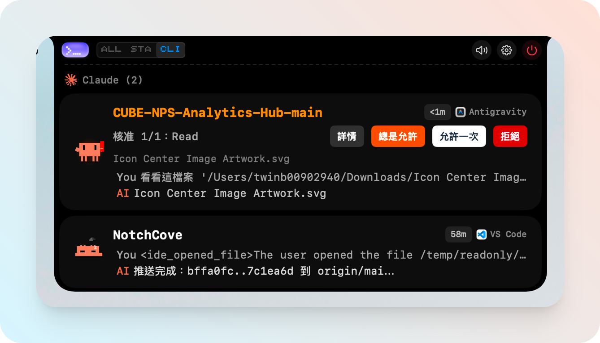

<h1 align="center">
  &nbsp;
  NotchCove
</h1>
<p align="center">
  <b>macOS 瀏海即時 AI 編碼 Agent 狀態面板</b><br>
  <a href="#安裝">安裝</a> •
  <a href="#功能特色">功能</a> •
  <a href="#支援的工具">支援的工具</a> •
  <a href="#從原始碼建置">建置</a><br>
  <a href="README.md">English</a> | 繁體中文
</p>

---

<p align="center">
  
</p>

## NotchCove 是什麼?

> 本專案是基於 [wxtsky/CodeIsland](https://github.com/wxtsky/CodeIsland) 的調整版本,並針對 UI 排版、字級對比、可及性(WCAG)、繁體中文在地化與 mascot/動畫做了大量重製。

NotchCove 住在你 MacBook 的瀏海區域,即時顯示 AI 編碼 Agent 的工作狀態。再也不用一直切窗口確認 Claude 是否在等待審批,或 Codex 是否完成任務。

它透過 Unix socket IPC 連接 **11 種 AI 編碼工具**,在瀏海面板裡呈現會話狀態、工具呼叫、權限請求等資訊——全部都在一個緊湊的像素風面板中。

## 功能特色

- **瀏海原生 UI** — 從 MacBook 瀏海展開,閒置時自動收起
- **緊湊瀏海模式** — 收合狀態下更貼近瀏海、極簡的版型
- **支援 11 種 AI 工具** — Claude Code、Codex、Gemini CLI、Cursor、Copilot、Trae/TraeCli、Qoder、Factory、CodeBuddy、OpenCode、Kimi Code CLI
- **即時狀態追蹤** — 活躍會話、工具呼叫、AI 回覆一目瞭然
- **非循序權限審批** — 多個權限請求可以任意順序 Allow / Deny,不必照排隊順序
- **互動式問答** — 無需切換應用,直接在瀏海面板回覆 Agent 的問題
- **像素角色 + Mascot Lab** — 每個 AI 工具都有專屬像素角色,可在 Mascot Lab 分頁預覽並調整
- **工作動畫** — 例如 Claude 等待時會做啞鈴彎舉,取代一般的轉圈 loader
- **精準跳轉** — 點擊會話可跳到對應的終端標籤頁或 IDE 視窗
- **智慧通知抑制** — 標籤頁層級偵測,只在你正看著該會話的分頁時抑制通知
- **自動安裝 Hook** — 自動為偵測到的 CLI 工具配置 hook,支援自動修復與版本追蹤
- **鍵盤快捷鍵** — 獨立的 Shortcuts 分頁管理全域熱鍵
- **遠端面板** — Remote 分頁可接收來自其他機器的事件
- **中英雙語 UI** — 跟隨系統語言在繁中/英文之間切換
- **多顯示器** — 支援外接螢幕,無瀏海的 Mac 也有優雅降級
- **音效提示** — 可選的 8-bit 風格音效

## 支援的工具

| | 工具 | 事件 | 跳轉 | 狀態 |
|:---:|------|------|------|------|
|  |  Claude Code | 13 | 終端標籤頁 | 完整 |
|  |  Codex | 3 | 終端 | 基本 |
|  |  Gemini CLI | 6 | 終端 | 完整 |
|  |  Cursor | 10 | IDE | 完整 |
|  |  TraeCli | 10 | 終端 | 完整 |
|  |  Qoder | 10 | IDE | 完整 |
| |  Copilot | 6 | 終端 | 完整 |
|  |  Factory | 10 | IDE | 完整 |
|  |  CodeBuddy | 10 | App/終端 | 完整 |
| |  Kimi Code CLI | 10 | 終端 | 完整 |
|  |  OpenCode | All | App/終端 | 完整 |

## 安裝

### 手動下載

1. [點擊下載最新版本](https://github.com/fantasynovel/NotchCove/releases/latest)(`NotchCove.dmg`)
2. 打開 DMG,將 **Notch Cove** 拖到 **Applications** 資料夾
3. 雙擊 App 打開 **Notch Cove**,首次打開會出現安全警告 ⚠️ ——**先不要丟垃圾桶!**

因為此版本沒有 Apple Developer 簽名(加入 Apple Developer Program 一年要 $99 USD),請依照以下任一方式解除:

**方式 A:** 到 **系統設定 → 隱私權與安全性**,往下滑找到「已阻擋 Notch Cove」,點擊 **仍要打開**

**方式 B:** 打開終端機,輸入以下指令後即可正常打開:

```bash
xattr -dr com.apple.quarantine "/Applications/Notch Cove.app"
```

解除後啟動 Notch Cove,會自動為偵測到的 AI 工具安裝 hook。

### 從原始碼建置

需要 **macOS 14+**、**Xcode 15+**、**Swift 5.9+**。

```bash
git clone https://github.com/fantasynovel/NotchCove.git
cd NotchCove

# 開發模式(debug 建置 + 啟動)
swift build && ./.build/debug/CodeIsland

# 發佈模式(universal binary:Apple Silicon + Intel)
./build.sh
open ".build/release/Notch Cove.app"
```

> 備註:Swift target 內部名稱目前仍是 `CodeIsland`(從原始 fork 沿用),程式碼層級的完整改名會在後續版本處理。

## 工作原理

```
AI 工具 (Claude/Codex/Gemini/Cursor/...)
  → 觸發 Hook 事件
    → codeisland-bridge(原生 Swift binary,約 86KB)
      → Unix socket → /tmp/codeisland-<uid>.sock
        → NotchCove 接收事件
          → 即時更新瀏海面板
```

NotchCove 在每個 AI 工具的設定中安裝輕量級 hook。當工具觸發事件(會話開始、工具呼叫、權限請求等),hook 會透過 Unix socket 發送 JSON 訊息,NotchCove 監聽此 socket 並即時更新瀏海面板。

**OpenCode** 採用 JS 插件直接連接 socket,不需要 bridge binary。

更多細節見 [docs/research/02-hook-protocol.md](./docs/research/02-hook-protocol.md) 與 [docs/research/03-unix-socket.md](./docs/research/03-unix-socket.md)。

## 設定

NotchCove 提供 9 個設定分頁:

- **General** — 語言、登入時啟動、顯示器選擇
- **Behavior** — 自動隱藏、智慧抑制、會話清理
- **Appearance** — 面板高度、字型大小、聊天列配色、即時預覽
- **Mascots** — Mascot Lab:預覽所有像素角色與動畫
- **Sound** — 8-bit 風格音效通知
- **Shortcuts** — 全域鍵盤快捷鍵
- **Remote** — 接收遠端機器送來的事件
- **Hooks** — 查看各 CLI 的安裝狀態,重裝或解除安裝
- **About** — 版本資訊與連結

## 隱私

NotchCove **完全 local-first**:

- ✅ 所有資料留在你 Mac 上
- ✅ 沒有帳號系統
- ✅ 沒有遙測 / 分析
- ✅ 不傳送對話內容到任何伺服器

## 系統需求

- macOS 14.0(Sonoma)或更高版本
- 在有瀏海的 MacBook 上體驗最完整,外接顯示器也支援

## 致謝

NotchCove fork 自 [wxtsky/CodeIsland](https://github.com/wxtsky/CodeIsland),向原作者致敬。

CodeIsland 本身受 [@farouqaldori](https://github.com/farouqaldori) 的 [claude-island](https://github.com/farouqaldori/claude-island) 啟發。

感謝:
- [@wxtsky](https://github.com/wxtsky) — CodeIsland
- [@farouqaldori](https://github.com/farouqaldori) — 將 AI Agent 狀態帶進瀏海的原創概念

完整歸屬見 [NOTICE](./NOTICE)。

## 授權

MIT License — 詳見 [LICENSE](LICENSE)。
